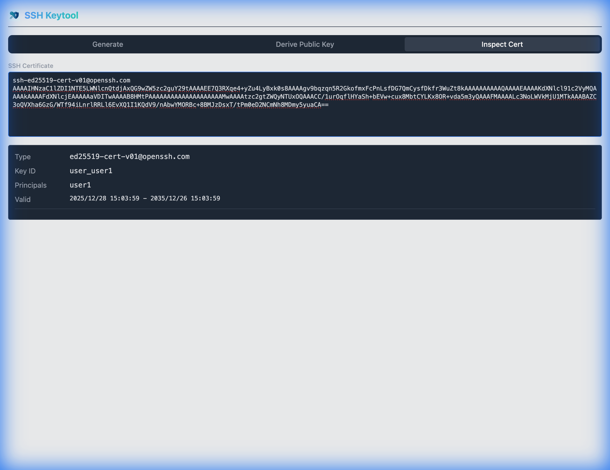

#  SSH Keytool Extension

A secure, offline-capable Chrome Extension for generating SSH key pairs, deriving public keys, inspecting SSH certificates, and converting private keys between OpenSSH, PEM (PKCS#1/PKCS#8), and PuTTY PPK formats — directly in your browser.

## Features

- **Generate SSH Keys**: Supports RSA (2048/4096-bit), ECDSA (nistp256/384/521), and ED25519.
- **Passphrase Protection**: Encrypt private keys with a passphrase using robust OpenSSH encryption.
- **Public Key Derivation**: Derive the associated public key from an existing private key.
- **SSH Certificate Inspection**: Inspect details of SSH certificates (Key ID, Principals, Validity, Extensions, etc.).
- **Key Format Conversion**: Convert private keys between OpenSSH, PKCS#1, PKCS#8 (PBES2 with PBKDF2-SHA256 + AES-256-CBC), and PuTTY PPK v2 formats. Add, remove, or change passphrases in one step.
- **Offline & Secure**: All cryptographic operations happen locally within the extension. No keys are ever sent to any server.
- **Modern UI**: Clean, responsive interface with Dark Mode support.

## Installation

1. Clone this repository.
2. Run `npm install` to install dependencies.
3. Run `npm run build` to build the extension.
4. Open Chrome and navigate to `chrome://extensions`.
5. Enable **Developer mode** in the top right.
6. Click **Load unpacked** and select the `dist` directory from the project folder.

## Usage

### Generating Keys
1. Open the extension popup.
2. Select the "Generate" tab.
3. Choose your desired algorithm (RSA, ED25519, or ECDSA) and key size.
4. (Optional) Enter a passphrase to encrypt the private key.
5. Click **Generate Key Pair**.
6. Copy the private and public keys to your clipboard.

### Deriving Public Keys
1. Select the "Derive Public Key" tab.
2. Paste your private key (OpenSSH/PEM format).
3. If the key is encrypted, enter the passphrase.
4. Click **Derive Public Key**.

### Inspecting SSH Certificates
1. Select the "Inspect Cert" tab.
2. Paste your SSH certificate (e.g., `ssh-rsa-cert-v01@openssh.com ...`).
3. View parsed details such as Type, Key ID, Valid Principals, Validity Period, Extensions, and Critical Options.

### Converting Keys
1. Select the "Convert" tab.
2. Paste your private key (OpenSSH, PKCS#1, PKCS#8, or PuTTY PPK). The source format is auto-detected and shown as a badge.
3. If the source key is encrypted, enter its passphrase in **Source Passphrase**.
4. Pick a **Target Format** (OpenSSH / PKCS#1 / PKCS#8 / PuTTY PPK v2).
5. (Optional) Enter a **Target Passphrase** to encrypt the output, or leave it empty for an unencrypted key. Changing or removing a passphrase is just a conversion to the same format with a different (or empty) target passphrase.
6. Click **Convert Key** and copy the output.

Notes:
- PKCS#1 is RSA-only — ED25519 / ECDSA keys cannot be exported as PKCS#1.
- Choosing PKCS#1 + a passphrase auto-upgrades the output to PKCS#8 (encrypted PKCS#1 is non-standard); a note is shown.
- PuTTY PPK v2 uses a weak SHA-1-based KDF without salt; a warning is shown when encrypting to PPK. Prefer OpenSSH or PKCS#8 when interop allows.

## Development

- `npm run dev`: Start development server (for UI testing in browser).
- `npm run build`: Build for production.
- `npm test`: Run verification scripts.

## License

MIT
