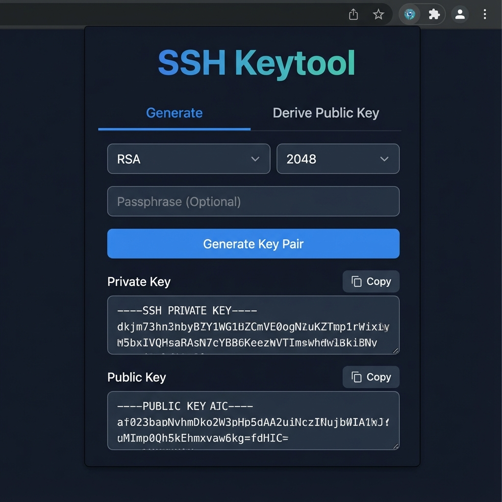

#  SSH Keytool Extension

A secure, offline-capable Chrome Extension for generating SSH key pairs and deriving public keys directly in your browser.

## Features

- **Generate SSH Keys**: Supports RSA (2048/4096-bit), ECDSA (nistp256/384/521), and ED25519.
- **Passphrase Protection**: Encrypt private keys with a passphrase using robust OpenSSH encryption.
- **Public Key Derivation**: Derive the associated public key from an existing private key.
- **Offline & Secure**: All cryptographic operations happen locally within the extension. No keys are ever sent to any server.
- **Modern UI**: Clean, responsive interface with Dark Mode support.

## Installation

1. Clone this repository.
2. Run `npm install` to install dependencies.
3. Run `npm run build` to build the extension.
4. Open Chrome and navigate to `chrome://extensions`.
5. Enable **Developer mode** in the top right.
6. Click **Load unpacked** and select the `dist` directory from the project folder.

## Usage

### Generating Keys
1. Open the extension popup.
2. Select the "Generate" tab.
3. Choose your desired algorithm (RSA, ED25519, or ECDSA) and key size.
4. (Optional) Enter a passphrase to encrypt the private key.
5. Click **Generate Key Pair**.
6. Copy the private and public keys to your clipboard.

### Deriving Public Keys
1. Select the "Derive Public Key" tab.
2. Paste your private key (OpenSSH/PEM format).
3. If the key is encrypted, enter the passphrase.
4. Click **Derive Public Key**.

## Development

- `npm run dev`: Start development server (for UI testing in browser).
- `npm run build`: Build for production.
- `npm test`: Run verification scripts.

## License

MIT
